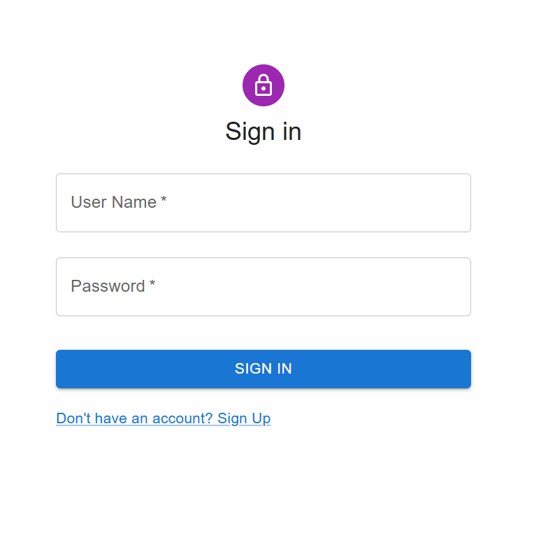
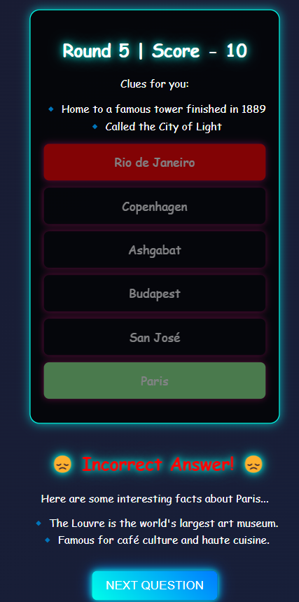
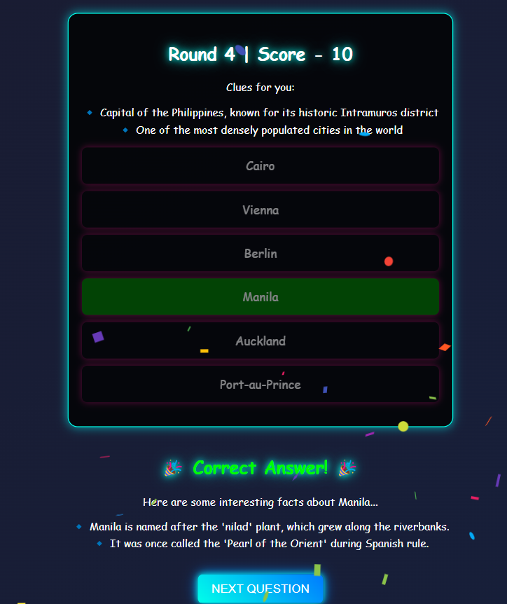
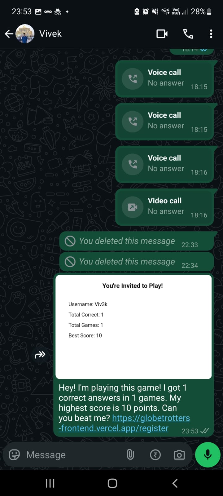
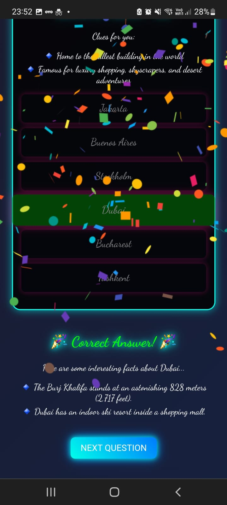

# Destination Trivia Game

## Images 
### Sign In
<br><br>
### Incorrect Answer
<br><br>
### Correct Answer
<br><br>
### Whatsapp feature
<br><br>
### Mobile View
<br><br>


## Overview

This project is a React + Flask web application that offers an engaging and fun destination-based trivia game. The game challenges users with clues and fun facts about destinations worldwide and lets them guess the correct answer. It includes dynamic features such as animations, score tracking, strict authentication, and a unique 'Challenge a Friend' option.

## Features

1. **User Authentication & Authorization:**

   - Utilizes JWT for secure login and registration.
   - Ensures strict authentication before accessing the game.
   - The frontend includes a Login Page, Registration Page, and Dashboard Page.

2. **Random Clues & Multiple Choice:**

   - The game presents 1–2 random clues for a randomly selected destination.
   - Users can select from multiple possible destination answers.

3. **Session Management:**

   - A new session is created every time a user starts the game.
   - Each round generates a new set of options, clues, and the correct answer.

4. **Funky Feedback System:**

   - 🎉 **Correct Answer:** Confetti animation with a fun fact reveal.
   - 😢 **Incorrect Answer:** Sad-face animation with a fun fact reveal.

5. **Navigation & Scoring:**

   - **Includes 'Play Again' or 'Next' buttons to load new random destinations.**
   - Tracks total score, including both correct and incorrect answers.

6. **Challenge a Friend:**

   - Allows users to register with a unique username.
   - Generates a shareable invite link and dynamic image for WhatsApp.
   - The dynamic image includes the user's correct attempts, total attempts, and total score.
   - Invited friends can view the invitee’s score before playing.
   - Complete game functionality for anyone with the invitation link.

## Dataset & AI Integration

- The initial dataset of 100+ destinations was generated using multiple AI tools, including GrokAI, ChatGPT, and Claude.
- Each destination includes clues, fun facts, and trivia.
- Future plans include automating dataset expansion via APIs and *integrating* image links related to each destination through web scraping or Google Search API.

## Tech Stack

- **Frontend:** React (with JWT authentication, animations, and dynamic UI)
- **Backend:** Flask (data handling, API integration, session management)
- **Database:** MySQL with SQLAlchemy (to manage game data, user profiles, and session history)
- **AI Tools:** GrokAI, ChatGPT, Claude

## UI Design

- The UI follows a **cyberpunk** theme, offering a vibrant and futuristic visual experience.
- The interface is dynamic and interactive, enhancing the overall gameplay.

## Hosting

- **Frontend:** Hosted on Vercel
- **Backend:** Hosted on PythonAnywhere

## Getting Started

### Prerequisites

- Node.js
- Python 3.x
- Flask
- React
- MySQL

### Installation

1. **Clone the repository:**

```bash
git clone https://github.com/Narcos101/Globetrotters-frontend.git
cd frontend
```

2. **Frontend Setup:**

```bash
npm install
npm start
```

### Running the Application

- Open the frontend on `https://globetrotters-frontend.vercel.app/`
- Backend runs on `https://narcos101.pythonanywhere.com`
- Database runs on `narcos101.mysql.pythonanywhere-services.com`

## Future Enhancements

- Automate the dataset generation process using AI APIs.
- Integrate image-based clues for a more visual experience.
- Add more animations and interactive elements.

## Contribution

Feel free to contribute to the project. Fork the repository, make your changes, and submit a pull request.

## License

This project is licensed under the MIT License.

